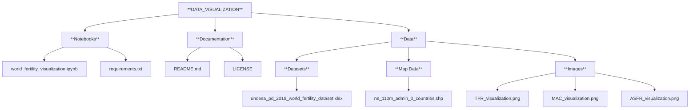

World Fertility Data Visualization Project
# An interactive visualization of global fertility trends using the World Fertility Data 2019 provided by the United Nations.

## Table of Contents
- [Introduction](#introduction)
- [Features](#features)
- [Dataset](#dataset)
- [Installation](#installation)
- [Usage](#usage)
- [Project Structure](#project-structure)
- [Visualization Overview](#visualization-overview)
- [License](#license)
- [References](#references)

## Introduction
Understanding global fertility trends is crucial for demographic research, policy-making, and socio-economic planning. This project provides an interactive map visualization of the World Fertility Data 2019, allowing users to explore age-specific fertility rates, total fertility rates, and mean age at childbearing across different countries and over time.

## Features
- **Interactive Map Visualization**: Explore fertility indicators globally with an interactive choropleth map.
- **Multiple Indicators**: View Total Fertility Rate (TFR), Age-Specific Fertility Rate (ASFR), and Mean Age at Childbearing (MAC).
- **Temporal Analysis**: Use a slider to navigate through different years from 1950 to the present.
- **Age Group Selection**: For ASFR, select specific age groups to analyze fertility rates.
- **Responsive Design**: The map updates dynamically based on user inputs.

## Dataset
- **Source**: World Fertility Data 2019
- **Description**: Contains empirical data on fertility rates collected from civil registration systems, population censuses, and sample surveys for 201 countries or areas.
- **Citation**: United Nations, Department of Economic and Social Affairs, Population Division (2019). World Fertility Data 2019. POP/DB/Fert/Rev2019.

## Installation

### Prerequisites
- Python 3.7 or higher
- Jupyter Notebook or JupyterLab
- Git (optional, for cloning the repository)

### Clone the Repository
```bash
git clone https://github.com/DJ-Greenwood/Data_visualization.git
cd world-fertility-data-visualization
```

### Create a Virtual Environment (Optional but Recommended)
```bash
python -m venv venv
source venv/bin/activate  # On Windows use `venv\Scripts\activate`
```

### Install Required Packages
```bash
pip install --upgrade pip setuptools
pip install -r requirements.txt
```
*Note: The `requirements.txt` file includes all necessary packages such as pandas, geopandas, ipyleaflet, ipywidgets, matplotlib, etc.*

## Usage

### Download the Data Files
- Download the World Fertility Data 2019 Excel file and place it in the `data/` directory.
- Download the World Map Shapefile from Natural Earth Data and place it in the `data/Map_data/` directory.

### Run the Jupyter Notebook
1. Launch Jupyter Notebook or JupyterLab.
2. Open the `world_fertility_visualization.ipynb` notebook.
3. Run all the cells to load the data and initialize the interactive map.

### Interact with the Map
- Use the Indicator dropdown to select a fertility indicator (TFR, ASFR, MAC).
- If ASFR is selected, choose an Age Group from the corresponding dropdown.
- Adjust the Year slider to navigate through different years.
- Click on a country on the map to view detailed information in a popup.

## Project Structure

- `data/`: Contains the fertility dataset and map shapefiles.
- `images/`: Screenshots of the visualizations.
- `world_fertility_visualization.ipynb`: The Jupyter Notebook with code and explanations.
- `requirements.txt`: List of required Python packages.
- `LICENSE`: License information for the project.
  
##### Note: All of the map files are not listed in this structure.


## Visualization Overview
- **Total Fertility Rate (TFR)**
- **Mean Age at Childbearing (MAC)**
- **Age-Specific Fertility Rate (ASFR)**

### Geographic and Temporal Dimensions
- Regional Comparisons: Show spatial differences in fertility trends across regions or countries.
- Time-Series Analysis: Highlight historical and future trends for TFR, MAC, and ASFR.

## License
This project is licensed under the MIT License.

## References
- **World Fertility Data 2019**
    - United Nations, Department of Economic and Social Affairs, Population Division (2019). World Fertility Data 2019. POP/DB/Fert/Rev2019. [Data Link](https://www.un.org/development/desa/pd/data/world-fertility-data)
        - Click on the dataset lable under the Data header, to download the data. 
- **Natural Earth Data**
    - 1:110m Cultural Vectors. [Download Link](https://www.naturalearthdata.com/downloads/110m-cultural-vectors/)
- **Python Libraries**
    - [Pandas Documentation](https://pandas.pydata.org/pandas-docs/stable/)
    - [GeoPandas Documentation](https://geopandas.org/)
    - [ipyleaflet Documentation](https://ipyleaflet.readthedocs.io/en/latest/)
    - [ipywidgets Documentation](https://ipywidgets.readthedocs.io/en/latest/)
